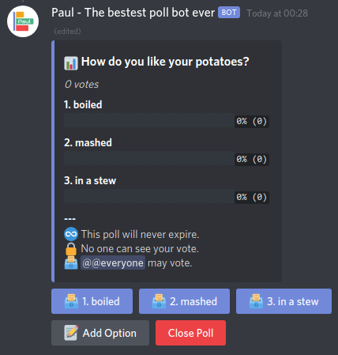
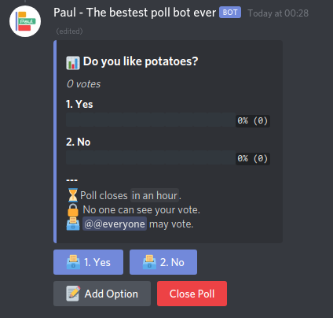

# Found. Poll Buddy

The discord bot that makes polls easy and fun in the Found. Community server.
This project is forked from [Paul Bot](https://github.com/abrahammurciano/paul-bot). Special thanks to [Abraham Murciano](https://github.com/abrahammurciano) @abrahammurciano for creating this amazing project. 

## Table of Contents

- [Features](#features)
- [Setup](#setup)
	- [Bot Creation](#bot-creation)
	- [Start](#start-the-bot)
- [Usage](#usage)
	- [question](#question)
	- [options](#options)
	- [expires](#expires)
	- [allow_multiple_votes](#allow_multiple_votes)
	- [allowed_vote_viewers](#allowed_vote_viewers)
	- [allowed_editors](#allowed_editors)
	- [allowed_voters](#allowed_voters)
	- [Closing the poll](#closing-the-poll)
- [Deploy](#deploy)


## Features
  - Uses a slash command to create the poll.
  - Uses buttons to vote and interact with existing polls.
  - Polls are persistent (That means if the bot goes offline it will remember its old polls when it  comes 	back online)
  - Highly customizable permissions for each action (voting, editing, viewing).
  - Set expiry dates on polls.
  - Option to allow multiple votes per person.
  - Option to allow certain people (or everyone) to view the votes.
  - Option to allow people to add options to the poll.
  - Option to restrict votes to certain roles and/or users.
  - Beautiful interface.
  - Button for the poll creator to close the poll at will.

## Setup

### Bot Creation

Go to Discord's [Developer Portal](https://discord.com/developers/applications) and create a new application. Copy the bot token and keep it safe.

### Start the Bot

```shell
git clone https://github.com/FoundTechnology/found-poll-buddy.git
docker build -f Dockerfile -t found-poll-buddy:latest .
cp example.env .env
# Fill in the .env file with the required values
docker compose up -d
```

### Invite the Bot

Replace the `<your-client-id>` and go to `https://discord.com/api/oauth2/authorize?client_id=<your-client-id>&permissions=2147551296&scope=bot%20applications.commands`

## Usage

This bot has a very simple interface. There is only one command. `/poll`. Below are the parameters it accepts.

### question

Specify the question that the poll is asking. This parameter is required.

> Example:
>
> `/poll question: Do you like potatoes?`
>
> 

### options

Choose which options will be available for people to vote for. This parameter is optional, and by default will be Yes/No.

When entering options, you must separate each option with a pipe character (`|`). (Trailing spaces around the pipe will be ignored.)

> Example:
>
> `/poll question: How do you like your potatoes? options: boiled | mashed | in a stew`
>
> 

### expires

With this parameter, you can choose when the poll will expire. Once the poll is expired, the vote buttons will disappear. By default, polls expire 30 days from creation.

When entering the expiry date/time, you may be quite liberal in its format. You can enter a relative date/time, such as "in 2 minutes", "1h20m", "tomorrow", "next week", etc; or you can enter an absolute date/time, such as "5 PM", "26 oct 2022", etc.

When using an absolute time such as "5 PM", it will be treated as UTC time. To specify a time zone, just include it in your input, for example "5 PM GMT+3" or "5 PM EST"

> Example:
>
> `/poll question: Do you like potatoes? expires: 1h20m`
>
> 

### allow_multiple_votes

With this parameter you can control whether or not to allow people to vote on several different options. By default each voter may vote for only one option. If you set this to True, then each voter can vote for each option up to one time.

> Example:
>
> `/poll question: Do you like potatoes? allow_multiple_votes: True`
>
> 

### allowed_vote_viewers

This parameter allows you to specify which users or roles are allowed to see who voted for each option. By default, votes are private and cannot be seen by anyone.

When specifying this parameter, you must mention all the roles and/or users you want to allow.

If this parameter is specified, then an additional button will appear underneath the poll which can be clicked by the allowed people for them to see the votes.

> Example:
>
> `/poll question: Do you like potatoes? allowed_vote_viewers: @everyone`
>
> 

### allowed_editors

With this parameter, you can specify who will be allowed to add options to the poll. By default, only you can add options.

People with permission may click the "Add Option" button, after which the bot will prompt them to enter a new option within a minute. When they do, the option will be added to the poll with a note saying who it was added by.

> Example:
>
> \*_Click "Add Option" button_
>
> 

### allowed_voters

Use this parameter to restrict who may vote to a set of users and roles. By default everyone may vote.

> Example:
>
> `/poll question: Do you like potatoes? allowed_voters: @Admin|🔱 @Abraham|👑🔱`
>
> 

### Closing the poll

You can use the big red button to close the poll manually without waiting for it to expire. Once you do this, there's no turning back. Only the poll creator can do this.
